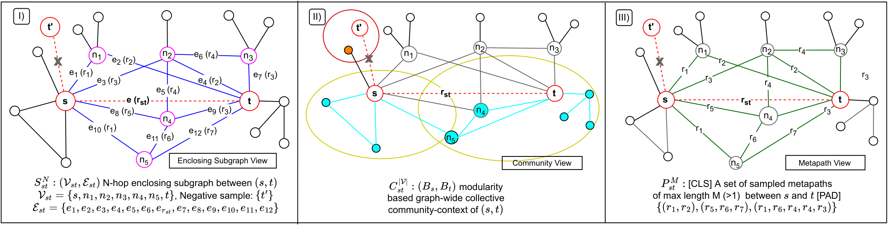

# MV-HRE: Multi-View Heterogeneous Relation Embedding
This is the official code-repository for the ICDM'22 paper [Revisiting Link Prediction on Heterogeneous Graphs with A Multi-view Perspective](https://dl.acm.org/doi/abs/10.1145/3447548.3467443).

## Motivation

    

MV-HRE is a multi-view network representation learning framework to incorporate structural intuitions and enrich the triplet representations for link prediction on heterogeneous graphs. MV-HRE incorporates Metapath-view and rarely studied Community-view for the task of link
prediction in HINs besides local-contexts. It proposes first-of-its-kind Community-view for a triplet. It effectively aggregates multiple views at difference scales to provide enriched structural cues to predict links. Analysis of view importance suggests that all the chosen candidate views are indeed important and complementary in achieving the best performance on heterogeneous link prediction.
